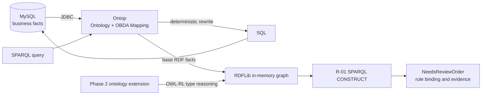

# Ontology + Ontop + SPARQL + MySQL

[中文](README.md) | [English](README.en.md)

[](https://github.com/zhangzhefang-github/ontology-vkg-demo/actions/workflows/integration-test.yml)

A reproducible enterprise semantic-layer architecture validation project. It evaluates the responsibilities, benefits, and costs of an Ontop virtual knowledge graph, OWL-RL type reasoning, and explicit business rules over relational data.

All business data remains in MySQL. Phase 1 verifies that Ontop deterministically rewrites SPARQL into SQL through a fixed mapping. Phase 2 verifies that an ontology can derive a parent type and that a separately maintained SPARQL rule can use that type to produce a business conclusion.

## Key findings

| Question | Verified result |
| --- | --- |
| Do SQL and Ontop SPARQL return the same result? | Yes. Both return purchase order 101 only. |
| Does the ontology participate in computation? | Yes. OWL-RL infers that E01 is a `SupplyDisruptionEvent`. |
| Is the business rule separate from Python control flow? | Yes. R-01 is an independent SPARQL CONSTRUCT file. |
| Does removing the subclass axiom change the result? | Yes. Base facts stay unchanged and R-01 no longer matches. |
| Is a stale conclusion retained after the event becomes inactive? | No. Every run starts from an empty in-memory graph. |
| Can SQL implement the same decision? | Yes. An independently executed equivalent SQL query is included. |

The normal conclusion is that purchase order 101 needs a supply-risk review. It does not mean delivery will necessarily fail. A rule not matching does not establish that an order is safe.

## Architecture



The ontology defines type semantics, the business rule defines the review decision, and Ontop provides a virtual semantic view over relational data. Derived `NeedsReviewOrder` facts are never persisted in MySQL.

## Quick start

The verified environment is Docker Desktop on Windows with WSL 2 Ubuntu. Enable Docker Desktop WSL Integration and ensure `docker compose` works inside WSL. Java, Maven, MySQL, Ontop, RDFLib, and owlrl do not need to be installed on the host.

```bash
git clone https://github.com/zhangzhefang-github/ontology-vkg-demo.git
cd ontology-vkg-demo
bash scripts/demo-phase2.sh
```

The command shows the complete pipeline:

```text
Ontop base facts
→ parent type inferred by OWL-RL
→ actual R-01 rule binding
→ final order and supporting evidence
```

Expected evidence:

```text
E01 rdf:type DeliverySuspensionEvent                 # Ontop base fact
E01 rdf:type SupplyDisruptionEvent                   # inferred from the ontology
R-01: order=101, event=E01, supplier=华北钢材        # rule binding
Purchase order 101 needs a supply-risk review        # conclusion
```

## Automated verification

Phase 1 SQL/SPARQL comparison:

```bash
bash scripts/test-sql.sh
bash scripts/test-sparql.sh
```

Complete Phase 2 counterfactual suite:

```bash
bash scripts/test-phase2.sh
```

The suite verifies normal reasoning, removal of the subclass axiom, event deactivation, event restoration, and an equivalent SQL query. A shell `trap` restores E01 after success, failure, or interruption. A successful run ends with:

```text
Phase 2 ALL PASS
```

## Scope and trade-offs

The exact implementation is **OWL-RL ontology reasoning followed by an explicit SPARQL rule**. It is not a Datalog deployment and does not use an LLM, vector database, graph database, or general-purpose rule platform.

SQL can implement the same three-table decision and is simpler at this scale. This project proves that the ontology participates in computation and that rules can be maintained independently. It does not claim that the semantic approach is inherently faster, more accurate, or cheaper than SQL.

The extra semantic layer becomes more compelling when multiple systems share business classifications, several concrete event types reuse an abstract rule, or semantics are governed across teams. SQL is usually simpler for a small number of tables and rules owned by one team.

## Repository layout

```text
ontology-vkg-demo/
├── docker-compose.yml          # MySQL, Ontop, disposable reasoner
├── Dockerfile                  # Ontop with MySQL JDBC
├── Dockerfile.reasoner         # RDFLib and owlrl
├── sql/                        # initial schema and idempotent migration
├── ontop/                      # base ontology, mapping, isolated Phase 2 axiom
├── queries/                    # SPARQL base-fact query and equivalent SQL
├── rules/                      # independent SPARQL CONSTRUCT rule
├── reasoner/                   # graph, reasoning, rule execution, evidence
├── scripts/                    # demo, migration, and verification entry points
└── docs/                       # design, validation, and troubleshooting
```

## Documentation

Detailed documentation is currently maintained in Chinese:

- [Phase 1: Ontop virtual knowledge graph](docs/phase-1-vkg.md)
- [Phase 2: ontology reasoning and business rule](docs/phase-2-reasoning.md)
- [Validation matrix and actual results](docs/validation.md)
- [Operations and troubleshooting](docs/troubleshooting.md)
- [Contributing](CONTRIBUTING.md)
- [Security policy](SECURITY.md)

## Pinned versions

| Component | Version |
| --- | --- |
| MySQL | `8.4.8` |
| Ontop | `5.5.0` |
| MySQL Connector/J | `8.4.0` |
| Python reasoner image | `3.12.11-slim-bookworm` |
| RDFLib / owlrl / pyparsing | `7.1.4` / `7.1.4` / `3.3.2` |

## Support, contributing, and license

Use [GitHub Issues](https://github.com/zhangzhefang-github/ontology-vkg-demo/issues) for questions and improvement proposals. Read [CONTRIBUTING.md](CONTRIBUTING.md) before submitting changes. Follow [SECURITY.md](SECURITY.md) for security reports and do not disclose sensitive information in a public issue.

Licensed under the [MIT License](LICENSE).
