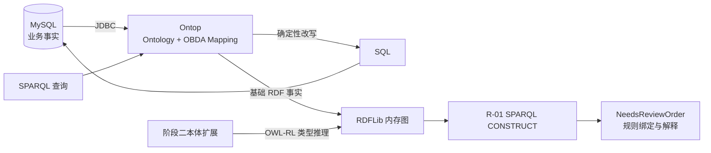

# Ontology + Ontop + SPARQL + MySQL

[中文](README.md) | [English](README.en.md)

[](https://github.com/zhangzhefang-github/ontology-vkg-demo/actions/workflows/integration-test.yml)

一个可复现的企业语义层架构验证项目，用于评估 Ontop 虚拟知识图谱、OWL-RL 类型推理和显式业务规则在关系数据库场景中的职责边界、收益与成本。

数据始终保留在 MySQL。第一阶段验证 Ontop 根据固定 Mapping 将 SPARQL 确定性改写为 SQL；第二阶段验证本体如何产生父类型事实，以及独立 SPARQL 规则如何据此产生业务结论。

## 核心结论

| 验证目标 | 结果 |
| --- | --- |
| SQL 与 Ontop SPARQL 是否一致 | 是，均只返回订单 101 |
| 本体是否真正参与计算 | 是，OWL-RL 推出 E01 属于 `SupplyDisruptionEvent` |
| 规则是否独立于 Python 业务分支 | 是，R-01 位于独立 SPARQL CONSTRUCT 文件 |
| 移除本体继承后规则是否失效 | 是，基础事实不变，R-01 不再命中 |
| 事件失效后结论是否撤回 | 是，每次从空内存图全量重算 |
| SQL 能否实现相同业务判断 | 能，本项目提供独立等价 SQL |

正常场景的结论是：订单 101 需要供应风险复核。它不表示订单必然无法交付；未命中规则也不表示其他订单安全。

## 架构



本体负责类型语义，业务规则负责复核判断，Ontop 负责关系数据到 RDF 语义层的虚拟映射。数据库不保存 `NeedsReviewOrder` 等派生事实。

## 快速开始

已验证环境为 Windows Docker Desktop + WSL 2 Ubuntu。需要 Docker Desktop 开启 WSL Integration，并确保 WSL 中可执行 `docker compose`。宿主机无需安装 Java、Maven、MySQL、Ontop、RDFLib 或 owlrl。

```bash
git clone https://github.com/zhangzhefang-github/ontology-vkg-demo.git
cd ontology-vkg-demo
bash scripts/demo-phase2.sh
```

演示命令依次输出：

```text
Ontop 基础事实
→ OWL-RL 新增的父类型事实
→ R-01 的实际规则绑定
→ 最终订单和支持证据
```

关键证据如下：

```text
E01 rdf:type DeliverySuspensionEvent                 # Ontop 基础事实
E01 rdf:type SupplyDisruptionEvent                   # 本体推理新增
R-01: order=101, event=E01, supplier=华北钢材        # 规则绑定
订单101需要供应风险复核                              # 最终结论
```

## 自动验证

第一阶段 SQL/SPARQL 对照：

```bash
bash scripts/test-sql.sh
bash scripts/test-sparql.sh
```

第二阶段完整对照实验：

```bash
bash scripts/test-phase2.sh
```

该脚本自动验证正常推理、移除继承公理、事件失效、事件恢复和等价 SQL。测试期间对 E01 的修改由 shell `trap` 恢复。成功时最后输出：

```text
Phase 2 ALL PASS
```

## 架构边界

本项目准确的实现方式是 **OWL-RL 本体推理 + 显式 SPARQL 规则执行**，没有部署 Datalog 引擎，也没有接入大模型、向量数据库、图数据库或复杂规则平台。

SQL 同样能完成当前三表判断，而且在这个规模下更直接。本项目只证明本体参与了计算、规则可以独立维护，不证明语义方案必然比 SQL 更快、更准确或更省成本。

当多个系统需要共享业务分类、多种具体事件需要复用同一抽象规则，或者语义由跨团队统一治理时，本体和规则层更可能值得。单库、少表、少规则且由同一团队维护时，SQL 通常更简单。

## 项目结构

```text
ontology-vkg-demo/
├── docker-compose.yml          # MySQL、Ontop、一次性推理容器
├── Dockerfile                  # Ontop + MySQL JDBC
├── Dockerfile.reasoner         # RDFLib + owlrl
├── sql/                        # 首次初始化和已有卷迁移
├── ontop/                      # 基础本体、Mapping、隔离的阶段二公理
├── queries/                    # SPARQL 基础事实查询和等价 SQL
├── rules/                      # 独立 SPARQL CONSTRUCT 规则
├── reasoner/                   # 内存图、推理、规则执行和证据输出
├── scripts/                    # 演示、迁移和自动测试入口
└── docs/                       # 原理、验证记录和排错文档
```

## 文档

- [第一阶段：Ontop 虚拟知识图谱](docs/phase-1-vkg.md)
- [第二阶段：本体推理与业务规则](docs/phase-2-reasoning.md)
- [验证矩阵与实际结果](docs/validation.md)
- [运行维护与故障排查](docs/troubleshooting.md)
- [贡献指南](CONTRIBUTING.md)
- [安全策略](SECURITY.md)

## 固定版本

| 组件 | 版本 |
| --- | --- |
| MySQL | `8.4.8` |
| Ontop | `5.5.0` |
| MySQL Connector/J | `8.4.0` |
| Python 推理镜像 | `3.12.11-slim-bookworm` |
| RDFLib / owlrl / pyparsing | `7.1.4` / `7.1.4` / `3.3.2` |

## 支持、贡献与许可证

使用问题或改进建议请提交 [GitHub Issue](https://github.com/zhangzhefang-github/ontology-vkg-demo/issues)。提交代码前请阅读 [CONTRIBUTING.md](CONTRIBUTING.md)；安全问题请遵循 [SECURITY.md](SECURITY.md)，不要在公开 Issue 中披露敏感信息。

本项目采用 [MIT License](LICENSE)。
